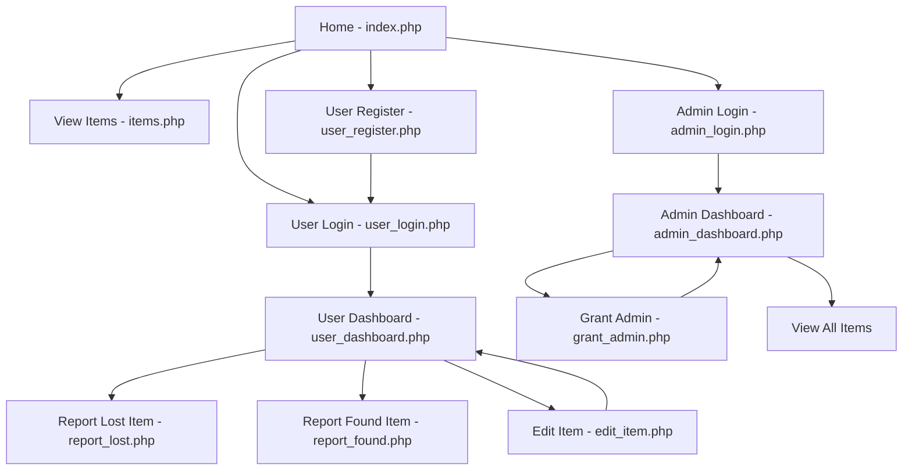

# University Lost and Found Portal - Sitemap

## Visual Sitemap

## Site Structure

### Public Pages (No Authentication Required)
- **Home** (`index.php`) - Landing page with statistics and recent items
- **View Items** (`items.php`) - Browse all lost and found items with search/filter functionality

### Authentication Pages
- **User Login** (`user_login.php`) - Login for registered users
- **User Register** (`user_register.php`) - Create new user account
- **Admin Login** (`admin_login.php`) - Admin authentication portal

### User Protected Pages (Login Required)
- **User Dashboard** (`user_dashboard.php`) - Personal dashboard to manage posted items
- **Report Lost** (`report_lost.php`) - Submit lost item reports
- **Report Found** (`report_found.php`) - Submit found item reports
- **Edit Item** (`edit_item.php`) - Edit user's posted items

### Admin Protected Pages (Admin Rights Required)
- **Admin Dashboard** (`admin_dashboard.php`) - Manage all items and users
- **Grant Admin** (`grant_admin.php`) - Assign admin rights to users

## Navigation Flow

1. **Public Access**: Users can view home and browse items without authentication
2. **User Registration**: New users register → redirected to login → access user dashboard
3. **User Actions**: Logged-in users can report lost/found items and manage their posts
4. **Admin Access**: Admin users login → access admin dashboard → manage system and users
5. **Logout**: Both user and admin logout returns to homepage

## Key Features by Page

### index.php
- Portal statistics (total, lost, found items)
- Recent 6 items display
- How it works section
- Tips for users
- Quick action buttons

### items.php
- Search functionality (title, description, location)
- Filter by type (all, lost, found)
- Statistics overview
- Image modal for enlarged view
- Contact information for each item

### user_dashboard.php
- User statistics (total, lost, found)
- List of user's posted items
- Edit and delete item actions
- Admin panel link (if user has admin rights)

### admin_dashboard.php
- System-wide statistics
- Recent items management
- User management (view, grant/remove admin, delete)
- Direct item deletion capability

### report_lost.php / report_found.php
- Item title and description
- Location information
- Contact email
- Image upload (required)
- Tips and guidelines

### edit_item.php
- Edit existing item details
- Update or replace item image
- Save changes or cancel

### grant_admin.php
- List all users
- Grant admin rights to specific users
- View current admin status
