# University Lost and Found Portal - Complete Sitemap Documentation

## Visual Sitemap

```mermaid
---
title: University Lost & Found Portal - Complete Site Navigation Map
---
graph TB
    Home["🏠 HOME PAGE<br/>━━━━━━━━━━━━━━━<br/>index.php<br/>━━━━━━━━━━━━━━━<br/>• Portal statistics display<br/>• 6 most recent items<br/>• Quick action buttons<br/>• How it works guide<br/>• No login required"]
    
    Home --> ViewItems["📋 VIEW ALL ITEMS<br/>━━━━━━━━━━━━━━━<br/>items.php<br/>━━━━━━━━━━━━━━━<br/>• Browse all lost/found items<br/>• Search by keyword<br/>• Filter by type lost/found/all<br/>• Image modal view<br/>• Email contact links<br/>• Public access"]
    
    Home --> UserLogin["🔐 USER LOGIN<br/>━━━━━━━━━━━━━━━<br/>user_login.php<br/>━━━━━━━━━━━━━━━<br/>• Username/password auth<br/>• Session creation<br/>• Auto-redirect to dashboard<br/>• Link to registration<br/>• Public access"]
    
    Home --> UserRegister["👤 NEW REGISTRATION<br/>━━━━━━━━━━━━━━━<br/>user_register.php<br/>━━━━━━━━━━━━━━━<br/>• Create new account<br/>• Username, email, password<br/>• Password hashing<br/>• Duplicate prevention<br/>• Auto-redirect to login<br/>• Public access"]
    
    Home --> AdminLogin["🛡️ ADMIN LOGIN<br/>━━━━━━━━━━━━━━━<br/>admin_login.php<br/>━━━━━━━━━━━━━━━<br/>• Admin authentication<br/>• Privilege verification<br/>• Security warnings<br/>• Access logging<br/>• Public access"]
    
    UserRegister -."Registration<br/>Success".-> UserLogin
    
    UserLogin --> UserDashboard["📊 USER DASHBOARD<br/>━━━━━━━━━━━━━━━<br/>user_dashboard.php<br/>━━━━━━━━━━━━━━━<br/>• Personal statistics<br/>• View all my items<br/>• Edit/delete items<br/>• Admin panel link if admin<br/>• Logout option<br/>🔒 Login Required"]
    
    UserDashboard --> ReportLost["📢 REPORT LOST ITEM<br/>━━━━━━━━━━━━━━━<br/>report_lost.php<br/>━━━━━━━━━━━━━━━<br/>• Submit lost item details<br/>• Title, description, location<br/>• Image upload required<br/>• Contact information<br/>• Tips & guidelines<br/>🔒 Login Required"]
    
    UserDashboard --> ReportFound["🔍 REPORT FOUND ITEM<br/>━━━━━━━━━━━━━━━<br/>report_found.php<br/>━━━━━━━━━━━━━━━<br/>• Submit found item details<br/>• Privacy protection tips<br/>• Image upload required<br/>• Finder contact info<br/>• Guidelines provided<br/>🔒 Login Required"]
    
    UserDashboard --> EditItem["✏️ EDIT MY ITEM<br/>━━━━━━━━━━━━━━━<br/>edit_item.php?id=X<br/>━━━━━━━━━━━━━━━<br/>• Modify item details<br/>• Update/replace image<br/>• Pre-filled form data<br/>• Ownership verification<br/>• Save or cancel changes<br/>🔒 Login Required"]
    
    EditItem -."Save Changes".-> UserDashboard
    
    AdminLogin --> AdminDashboard["⚙️ ADMIN DASHBOARD<br/>━━━━━━━━━━━━━━━<br/>admin_dashboard.php<br/>━━━━━━━━━━━━━━━<br/>• System-wide statistics<br/>• View/delete any item<br/>• User management<br/>• Grant/revoke admin rights<br/>• Delete user accounts<br/>• View last 10 items<br/>🔒 Admin Only"]
    
    AdminDashboard --> GrantAdmin["🔑 GRANT ADMIN RIGHTS<br/>━━━━━━━━━━━━━━━<br/>grant_admin.php<br/>━━━━━━━━━━━━━━━<br/>• View all users list<br/>• Grant admin by username<br/>• Check current admin status<br/>• Security warnings<br/>• Success feedback<br/>🔒 Admin Only"]
    
    AdminDashboard --> ViewAllItems["👁️ MANAGE ALL ITEMS<br/>━━━━━━━━━━━━━━━<br/>items.php via admin<br/>━━━━━━━━━━━━━━━<br/>• View portal as user<br/>• Browse all items<br/>• Return to admin panel<br/>🔒 Admin Only"]
    
    GrantAdmin -."Return".-> AdminDashboard
    
    ViewAllItems -."Return".-> AdminDashboard
    
    classDef publicPage fill:#e3f2fd,stroke:#2563eb,stroke-width:2px
    classDef authPage fill:#fff3e0,stroke:#f59e0b,stroke-width:2px
    classDef userPage fill:#f0fdf4,stroke:#10b981,stroke-width:2px
    classDef adminPage fill:#fce7f3,stroke:#ec4899,stroke-width:2px
    
    class Home,ViewItems publicPage
    class UserLogin,UserRegister,AdminLogin authPage
    class UserDashboard,ReportLost,ReportFound,EditItem userPage
    class AdminDashboard,GrantAdmin,ViewAllItems adminPage
```

## Detailed Page Documentation

### 🏠 PUBLIC PAGES (No Authentication Required)

#### **index.php** - Homepage & Portal Landing
**Purpose**: Main entry point showcasing portal capabilities and recent activity

**Key Features**:
- **Portal Statistics Dashboard**: Real-time counts of total items, lost items, and found items
- **Recent Items Display**: Shows 6 most recent posts with images, descriptions, and contact info
- **Quick Action Buttons**: Direct links to report lost/found items or browse all items
- **How It Works Section**: 3-step guide explaining the portal workflow
- **Tips for Success**: Best practices for reporting items and increasing recovery chances
- **Responsive Navigation**: Mobile-friendly menu with hamburger toggle

**User Actions**:
- View recent items without login
- Navigate to report forms (requires login)
- Browse all items
- Access login/register pages
- See portal statistics

**Technical Details**:
- Queries last 6 items ordered by creation date
- Displays item images with fallback placeholder
- Shows statistics using SQL aggregate functions
- Conditional navigation based on login status

---

#### **items.php** - Browse All Lost & Found Items
**Purpose**: Comprehensive item browsing with search and filter capabilities

**Key Features**:
- **Advanced Search**: Search by title, description, or location using LIKE queries
- **Type Filter**: Filter to show all items, only lost items, or only found items
- **Statistics Bar**: Quick stats showing total, lost, and found item counts
- **Results Counter**: Dynamic display of filtered results vs total items
- **Image Modal**: Click images for enlarged view with lightbox effect
- **Real-time Filtering**: Client-side filtering for instant results
- **Contact Information**: Direct email links for each item owner/finder

**User Actions**:
- Search items by keyword
- Filter by type (lost/found)
- View enlarged item images
- Contact item owners via email
- Clear filters to reset view
- Navigate to report forms

**Technical Details**:
- Dynamic SQL query building based on filters
- GET parameter handling for search and filter
- Client-side JavaScript for real-time search
- Modal window for image viewing
- Responsive grid layout for item cards
- SQL injection prevention with mysqli_real_escape_string()

**Search Parameters**:
- `?search=keyword` - Search term
- `?filter=lost|found|all` - Item type filter

---

### 🔐 AUTHENTICATION PAGES

#### **user_login.php** - User Authentication
**Purpose**: Secure login portal for registered users

**Key Features**:
- **Username/Password Authentication**: Standard login form with validation
- **Password Verification**: Uses password_verify() for secure password checking
- **Session Management**: Creates user session with user_id, username, and email
- **Admin Detection**: Automatically redirects admin users to admin dashboard
- **Success Messages**: Shows registration success message when redirected from register
- **Link to Registration**: Easy access to create new account

**User Actions**:
- Login with username and password
- Navigate to registration page
- Return to homepage

**Session Data Created**:
- `$_SESSION['user_id']` - User ID
- `$_SESSION['username']` - Username
- `$_SESSION['user_email']` - User email
- `$_SESSION['is_admin']` - Admin flag (if applicable)

**Redirect Logic**:
- Admin users → admin_dashboard.php
- Regular users → user_dashboard.php
- Failed login → Stay on page with error message

---

#### **user_register.php** - New User Registration
**Purpose**: Account creation for new portal users

**Key Features**:
- **User Information Collection**: Username, email, and password
- **Password Confirmation**: Validates matching passwords
- **Duplicate Prevention**: Checks for existing username/email
- **Password Hashing**: Uses password_hash(PASSWORD_DEFAULT) for security
- **Email Validation**: Ensures valid email format
- **Auto-redirect**: Sends to login page upon successful registration

**User Actions**:
- Create new account
- Navigate to login page
- Return to homepage

**Validation Rules**:
- Username: Required, must be unique
- Email: Required, valid format, must be unique
- Password: Required, minimum 6 characters
- Confirm Password: Must match password

**Database Entry**:
- Stores username, email, hashed password
- Sets is_admin = 0 by default
- Records creation timestamp

---

#### **admin_login.php** - Administrator Authentication
**Purpose**: Secure login portal for administrators

**Key Features**:
- **Admin Verification**: Uses same login but checks admin privileges
- **Access Denial**: Rejects non-admin users with clear message
- **Security Warning**: Displays authorization notice
- **Session Destruction**: Clears session if non-admin attempts access
- **Auto-redirect**: Redirects already-logged-in admins to dashboard

**User Actions**:
- Login with admin credentials
- Return to portal homepage

**Security Features**:
- Checks is_admin flag in database
- Destroys session if user lacks admin rights
- Displays security warning about logged access
- Redirects admins already logged in

---

### 📊 USER PROTECTED PAGES (Login Required)

#### **user_dashboard.php** - Personal Dashboard
**Purpose**: Central hub for users to manage their posted items

**Key Features**:
- **Welcome Header**: Personalized greeting with username and email display
- **Personal Statistics**: Cards showing user's total items, lost items, and found items
- **My Items List**: Grid view of all user's posted items with images
- **Item Management**: Edit and delete buttons for each item
- **Admin Badge**: Special badge and link to admin panel if user has admin rights
- **Direct Deletion**: Delete items instantly without approval process
- **Image Display**: Shows uploaded images or placeholder for items
- **Quick Actions**: Links to report new items

**User Actions**:
- View all personal items
- Edit any posted item
- Delete items (with confirmation)
- Navigate to report forms
- Access admin panel (if admin)
- Logout

**Statistics Displayed**:
- Total items posted by user
- Number of lost items posted
- Number of found items posted

**Item Card Information**:
- Item type badge (Lost/Found)
- Item image or placeholder
- Title and description
- Location and contact info
- Timestamp of posting
- Edit and Delete buttons

**Deletion Process**:
- Confirms deletion with JavaScript prompt
- Deletes physical image file from uploads/
- Removes database record
- Shows success message

---

#### **report_lost.php** - Report Lost Item
**Purpose**: Allow users to submit detailed lost item reports

**Key Features**:
- **Required Image Upload**: Ensures visual identification capability
- **Detailed Form**: Title, description, location, and contact fields
- **File Type Validation**: Client and server-side validation for image types
- **Unique Filename**: Uses uniqid() to prevent file name conflicts
- **Auto-fill Contact**: Can pre-populate with user's email
- **Tips Section**: Guidance on writing effective lost item reports
- **Form Validation**: Ensures all required fields are filled
- **Success Feedback**: Confirmation message upon successful submission

**User Actions**:
- Fill out item details
- Upload item image
- Submit lost item report
- Cancel and return home

**Required Fields**:
- **Title**: Brief item identifier (e.g., "Black iPhone 13")
- **Description**: Detailed description with unique features
- **Location**: Last known location with specific details
- **Contact**: Email address for contact
- **Image**: Photo of the item (JPG, JPEG, PNG, or GIF)

**Tips Provided**:
- Be specific with details (brand, model, color)
- Include unique markings or features
- Provide exact location information
- Upload clear, well-lit photos

**File Upload Process**:
1. Validates file type (jpg, jpeg, png, gif)
2. Generates unique filename with uniqid()
3. Moves file to uploads/ directory
4. Stores filename in database
5. Links item to current user's ID

---

#### **report_found.php** - Report Found Item
**Purpose**: Allow users to submit detailed found item reports

**Key Features**:
- **Required Image Upload**: Visual proof of found item
- **Privacy Guidance**: Tips on protecting personal info found on items
- **Detailed Form**: Same structure as report_lost.php but for found items
- **Contact Information**: Finder's contact for item pickup arrangements
- **Location Details**: Where the item was found
- **Tips Section**: Guidance on protecting owner's privacy
- **Form Validation**: Server and client-side validation

**User Actions**:
- Fill out found item details
- Upload item image
- Submit found item report
- Cancel and return home

**Required Fields**:
- **Title**: Item identifier
- **Description**: Details without revealing personal info
- **Location**: Where item was found
- **Contact**: Finder's email for coordination
- **Image**: Photo of found item

**Privacy Guidelines**:
- Don't share personal info found on items
- Avoid showing ID cards or sensitive documents
- Let owner prove ownership through description
- Cover or blur personal information in photos

**Database Storage**:
- Type set to 'found'
- Links to current user's ID
- Stores all item details
- Records creation timestamp

---

#### **edit_item.php** - Edit Posted Item
**Purpose**: Allow users to modify their posted item details

**Key Features**:
- **Ownership Verification**: Ensures user can only edit their own items
- **Pre-filled Form**: Loads existing item data into form fields
- **Image Management**: Option to keep or replace current image
- **Current Image Display**: Shows existing image above upload field
- **Old Image Deletion**: Automatically deletes old image when new one uploaded
- **Validation**: Ensures all required fields remain filled
- **Success Feedback**: Confirms successful update
- **Cancel Option**: Return to dashboard without changes

**User Actions**:
- Modify title, description, location, or contact
- Upload new image (optional)
- Save changes
- Cancel and return to dashboard

**Editable Fields**:
- Title
- Description
- Location
- Contact email
- Image (optional update)

**Access Control**:
- Verifies item belongs to logged-in user
- Redirects to dashboard if unauthorized
- Uses user_id from session

**Image Update Process**:
1. If new image uploaded:
   - Validates file type
   - Deletes old image file
   - Uploads new image
   - Updates database with new filename
2. If no new image:
   - Keeps existing image filename

---

### ⚙️ ADMIN PROTECTED PAGES (Admin Rights Required)

#### **admin_dashboard.php** - System Administration Panel
**Purpose**: Central control panel for managing entire portal system

**Key Features**:
- **System-wide Statistics**: Total items, lost items, and found items across all users
- **Recent Items Table**: Last 10 items posted with management actions
- **User Management**: Complete user administration with role management
- **Direct Item Deletion**: Remove any item immediately without approval
- **Admin Rights Management**: Grant or revoke admin privileges
- **User Deletion**: Remove users and all their items
- **Image Preview**: Thumbnail images in item listings
- **Expandable Descriptions**: "Read more" for long item descriptions
- **Item Count per User**: Shows how many items each user has posted
- **Admin Badge Display**: Visual indicators for admin users

**Admin Actions**:
- View all system statistics
- Delete any item (with confirmation)
- View all registered users
- Grant admin rights to users
- Remove admin rights from users
- Delete user accounts
- Navigate to Grant Admin tool
- View portal as regular user
- Logout

**Statistics Dashboard**:
- Total Items: Count of all items in system
- Lost Items: Total lost items reported
- Found Items: Total found items reported

**Recent Items Section**:
- Displays last 10 items posted
- Shows item image thumbnail
- Item type badge (Lost/Found)
- Full item details (title, description, location, contact)
- Timestamp of posting
- View and Delete buttons
- Expandable descriptions for long text

**User Management Section**:
- Lists all registered users
- Shows username and email
- Displays item count per user
- Admin badge for admin users
- Join date for each user
- Actions: View Items, Make/Remove Admin, Delete User

**Deletion Capabilities**:
- **Items**: Deletes image file + database record
- **Users**: Deletes user and all associated items
- Confirmation prompts for all deletions

**Admin Rights Management**:
- Toggle admin status with one click
- Updates is_admin flag in database
- Visual feedback on status change
- Cannot revoke own admin rights

**Security Features**:
- requireAdmin() function blocks unauthorized access
- All actions logged in session
- Confirmation dialogs for destructive actions

**Visual Design**:
- Red admin header bar for clear identification
- Color-coded action buttons
- Responsive tables and cards
- Mobile-friendly layout
- Admin-specific styling

---

#### **grant_admin.php** - Admin Rights Assignment Tool
**Purpose**: Dedicated interface for granting administrator privileges

**Key Features**:
- **Security Warning**: Prominent warning to delete file after use
- **User List Display**: Shows all registered users with admin status
- **Username Input**: Simple form to grant admin by username
- **Status Checking**: Validates user exists before granting rights
- **Duplicate Prevention**: Alerts if user already has admin rights
- **Success Feedback**: Confirms successful admin grant
- **Admin-only Access**: Protected by requireAdmin() function
- **User Information Display**: Shows username, email, and current status

**Admin Actions**:
- View all users and their admin status
- Grant admin rights by username
- Return to admin dashboard
- Return to portal homepage
- Logout

**User List Display**:
- Username
- Email address
- Current admin status (badge)
- Visual admin indicator

**Grant Process**:
1. Admin enters username
2. System validates user exists
3. Checks if already admin
4. Updates is_admin flag to 1
5. Displays success message

**Error Handling**:
- User not found: Error message
- Already admin: Info message
- Database error: Error message with details

**Security Warnings**:
- Delete file after initial setup
- Unauthorized access prevention
- Admin authentication required
- All actions logged

---

## Complete Navigation Flow

### Public User Journey
1. **Landing** → Visit index.php
2. **Browse** → View items.php without login
3. **Register** → Create account via user_register.php
4. **Verify** → Redirect to user_login.php with success message
5. **Login** → Authenticate and redirect to user_dashboard.php

### Registered User Journey
1. **Login** → Authenticate via user_login.php
2. **Dashboard** → View personal items in user_dashboard.php
3. **Report Lost** → Submit lost item via report_lost.php
4. **Report Found** → Submit found item via report_found.php
5. **Edit** → Modify item via edit_item.php?id=X
6. **Delete** → Remove item from dashboard
7. **Browse** → View all items in items.php
8. **Logout** → End session, return to index.php

### Admin User Journey
1. **Login** → Authenticate via admin_login.php or user_login.php
2. **Auto-redirect** → Sent to admin_dashboard.php
3. **Manage Items** → View and delete any items
4. **Manage Users** → Grant/revoke admin, delete users
5. **Grant Admin** → Use grant_admin.php for new admins
6. **Portal View** → View site as regular user
7. **Logout** → End session, return to index.php

### Search & Filter Flow (items.php)
1. **Initial Load** → Shows all items
2. **Type Filter** → Select lost/found/all from dropdown
3. **Search** → Enter keyword in search box
4. **Apply** → Click button or auto-filter (JavaScript)
5. **Results** → Filtered items display
6. **Clear** → Reset to show all items
7. **Image View** → Click image for modal enlargement
8. **Contact** → Click email to send message

---

## Technical Architecture

### Database Schema

#### **users** Table
- `id` (INT, PRIMARY KEY, AUTO_INCREMENT) - Unique user identifier
- `username` (VARCHAR) - Unique username for login
- `email` (VARCHAR) - Unique email address
- `password` (VARCHAR) - Hashed password using PASSWORD_DEFAULT
- `is_admin` (TINYINT) - Admin flag (0 = user, 1 = admin)
- `created_at` (TIMESTAMP) - Account creation timestamp

#### **items** Table
- `id` (INT, PRIMARY KEY, AUTO_INCREMENT) - Unique item identifier
- `user_id` (INT, FOREIGN KEY) - References users.id
- `title` (VARCHAR) - Item title/name
- `description` (TEXT) - Detailed item description
- `type` (ENUM: 'lost', 'found') - Item type
- `location` (VARCHAR) - Location details
- `contact` (VARCHAR) - Contact email
- `image` (VARCHAR) - Filename of uploaded image
- `created_at` (TIMESTAMP) - Item posting timestamp

### File Structure

**Core Configuration Files**:
- `db.php` - Database connection singleton with auto-initialization
- `user_config.php` - User authentication functions
- `admin_config.php` - Admin authentication functions

**Public Pages**:
- `index.php` - Homepage
- `items.php` - Browse items

**Authentication Pages**:
- `user_login.php` - User login
- `user_register.php` - User registration  
- `admin_login.php` - Admin login

**User Protected Pages**:
- `user_dashboard.php` - User dashboard
- `report_lost.php` - Report lost item
- `report_found.php` - Report found item
- `edit_item.php` - Edit item

**Admin Protected Pages**:
- `admin_dashboard.php` - Admin dashboard
- `grant_admin.php` - Grant admin rights

**Assets & Resources**:
- `style.css` - Main stylesheet
- `script.js` - JavaScript functionality
- `uploads/` - Image storage directory
- `assets/` - Logo and favicon

### Authentication System

**User Authentication**:
- Session-based authentication
- Password hashing with `password_hash(PASSWORD_DEFAULT)`
- Password verification with `password_verify()`
- Session variables: user_id, username, user_email, is_admin

**Function Library** (user_config.php):
- `registerUser($conn, $username, $email, $password)` - Create new account
- `loginUser($conn, $username, $password)` - Authenticate user
- `logoutUser()` - Destroy session
- `isUserLoggedIn()` - Check login status
- `requireUser()` - Force login or redirect
- `getCurrentUserId()` - Get current user ID
- `getCurrentUsername()` - Get current username
- `getCurrentUserEmail()` - Get current email
- `isCurrentUserAdmin()` - Check admin status

**Admin Authentication** (admin_config.php):
- `isAdminLoggedIn()` - Check admin status
- `requireAdmin()` - Force admin login or redirect
- `logoutAdmin()` - Destroy admin session

### Security Measures

**SQL Injection Prevention**:
- All user inputs sanitized with `mysqli_real_escape_string()`
- Prepared statement patterns in use
- Input validation on all forms

**Password Security**:
- Passwords hashed with bcrypt (PASSWORD_DEFAULT)
- Never stored or transmitted in plain text
- Minimum 6 character requirement

**File Upload Security**:
- File type whitelist (jpg, jpeg, png, gif only)
- Unique filenames using `uniqid()` prevent overwriting
- Server-side and client-side validation
- Files stored outside document root when possible

**Session Security**:
- Session-based authentication
- Session variables for user state
- Automatic session destruction on logout
- Session validation on protected pages

**Access Control**:
- Page-level protection with requireUser() and requireAdmin()
- Ownership verification for edit/delete operations
- Redirect unauthorized users to login

### Image Management

**Upload Process**:
1. Validate file type (whitelist)
2. Generate unique filename with `uniqid()`
3. Move file to uploads/ directory
4. Store filename in database
5. Display using relative path

**Storage**:
- Physical files in `uploads/` directory
- Database stores filename only (not full path)
- Image displayed via: `uploads/{filename}`

**Deletion**:
- Automatic cleanup when item deleted
- Uses `unlink()` to remove physical file
- Prevents orphaned files
- Checks file exists before deletion

**Display**:
- Thumbnail in item cards
- Full size in modal lightbox
- Fallback placeholder if no image
- Responsive image sizing

---

## Page-Level Features Matrix

| Feature | index.php | items.php | user_login.php | user_register.php | user_dashboard.php | report_lost.php | report_found.php | edit_item.php | admin_login.php | admin_dashboard.php | grant_admin.php |
|---------|-----------|-----------|----------------|-------------------|--------------------|-----------------|--------------------|---------------|-----------------|---------------------|------------------|
| **View Items** | ✓ Recent | ✓ All | ✗ | ✗ | ✓ Own | ✗ | ✗ | ✗ | ✗ | ✓ All | ✗ |
| **Search** | ✗ | ✓ | ✗ | ✗ | ✗ | ✗ | ✗ | ✗ | ✗ | ✗ | ✗ |
| **Filter** | ✗ | ✓ | ✗ | ✗ | ✗ | ✗ | ✗ | ✗ | ✗ | ✗ | ✗ |
| **Statistics** | ✓ | ✓ | ✗ | ✗ | ✓ Personal | ✗ | ✗ | ✗ | ✗ | ✓ System | ✗ |
| **Upload Image** | ✗ | ✗ | ✗ | ✗ | ✗ | ✓ | ✓ | ✓ Optional | ✗ | ✗ | ✗ |
| **Edit Items** | ✗ | ✗ | ✗ | ✗ | ✓ Own | ✗ | ✗ | ✓ | ✗ | ✗ | ✗ |
| **Delete Items** | ✗ | ✗ | ✗ | ✗ | ✓ Own | ✗ | ✗ | ✗ | ✗ | ✓ Any | ✗ |
| **User Management** | ✗ | ✗ | ✗ | ✗ | ✗ | ✗ | ✗ | ✗ | ✗ | ✓ | ✗ |
| **Grant Admin** | ✗ | ✗ | ✗ | ✗ | ✗ | ✗ | ✗ | ✗ | ✗ | Link | ✓ |
| **Authentication** | None | None | Login | Register | Required | Required | Required | Required | Admin Login | Admin Required | Admin Required |
| **Mobile Responsive** | ✓ | ✓ | ✓ | ✓ | ✓ | ✓ | ✓ | ✓ | ✓ | ✓ | ✓ |

---

## URL Parameters & Query Strings

### items.php
- `?search=keyword` - Search for items containing keyword
- `?filter=lost` - Show only lost items
- `?filter=found` - Show only found items  
- `?filter=all` - Show all items (default)

### edit_item.php
- `?id=123` - Item ID to edit (required)

### user_login.php
- `?registered=1` - Shows registration success message

### user_dashboard.php
- `?logout=1` - Triggers logout action

### admin_dashboard.php  
- `?logout=1` - Triggers admin logout

---

## Form Validations

### user_register.php
**Client-side**:
- All fields required
- Email format validation
- Password minimum length (HTML5)

**Server-side**:
- Username uniqueness check
- Email uniqueness check
- Email format validation
- Password match confirmation
- Minimum password length (6 chars)

### user_login.php  
**Server-side**:
- Username exists check
- Password verification
- Account status validation

### report_lost.php & report_found.php
**Client-side**:
- All fields required
- Email format
- Image file required
- File type validation (accept="image/*")

**Server-side**:
- All fields filled check
- Image uploaded check
- File type whitelist (jpg, jpeg, png, gif)
- Email format validation

### edit_item.php
**Server-side**:
- Ownership verification
- All fields required
- Optional image validation if uploaded
- File type whitelist

---

## Error Handling

### Database Errors
- Connection failures display error message
- Query failures show mysqli_error() details
- Graceful fallback for missing data

### File Upload Errors
- Invalid file types rejected
- Upload size limits enforced
- Missing files detected
- Write permission errors caught

### Authentication Errors  
- Invalid credentials show error message
- Missing session redirects to login
- Unauthorized access redirects
- Session timeout handling

### Validation Errors
- Empty fields detected
- Format errors (email, etc.)
- Duplicate entries prevented
- Clear error messages displayed

---

## User Interface Components

### Navigation Header
**Elements**:
- Logo image (logo.webp)
- Site title
- Hamburger menu toggle (mobile)
- Navigation links
- Dynamic menu based on login status

**Conditional Links**:
- **Not logged in**: Login, Register
- **Logged in**: My Dashboard, Logout
- **Admin**: Admin Panel link appears

### Item Cards
**Components**:
- Type badge (Lost/Found)
- Item image or placeholder
- Title with icon
- Description (truncated)
- Location with map icon
- Contact with email icon  
- Timestamp
- Action buttons (context-dependent)

### Alert Messages
**Types**:
- Success (green) - Successful actions
- Error (red) - Failed actions, errors
- Info (blue) - Informational messages

### Forms
**Standard Components**:
- Form groups with labels
- Text inputs
- Textareas
- Email inputs
- File upload inputs
- Submit buttons
- Cancel links

### Statistics Cards
**Display**:
- Large number (metric)
- Descriptive label
- Color coding (blue/red/green)
- Responsive grid layout

---

## Responsive Design Breakpoints

### Desktop (> 768px)
- Full navigation menu
- Multi-column layouts
- Large statistics cards
- Grid layouts for items

### Tablet (481px - 768px)
- Collapsible navigation
- 2-column grids
- Medium-sized cards
- Adjusted padding

### Mobile (≤ 480px)
- Hamburger menu
- Single column layout
- Stacked elements
- Touch-friendly buttons
- Reduced padding

---
